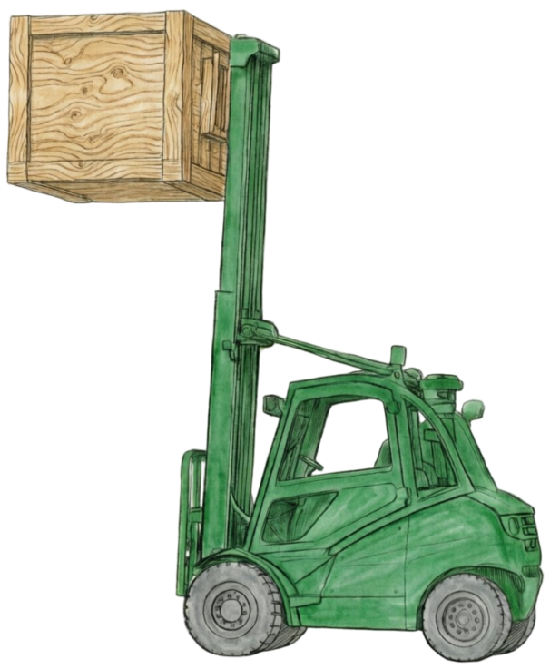

  

# СкладЪ — WMS-система с визуализацией складов и интеграцией 1С

**СкладЪ** (складъ.рус) — это полнофункциональная WMS-система (Warehouse Management System) для управления складами с интерактивной визуализацией и двусторонней интеграцией с 1С:Управление торговлей.

Проект демонстрирует построение сложной full-stack экосистемы с глубокой интеграцией корпоративных систем учёта.

🌐 **Демо:** [складъ.рус](https://складъ.рус) | 📧 **Доступ:** [sky_1c@mail.ru](mailto:sky_1c@mail.ru?subject=Запрос%20доступа%20к%20складъ.рус)

---

## Скриншоты проекта

*Обзор всех складов с актуальными остатками*

*Настройка базовых параметров: адрес, размеры, организация*

*Визуальное создание зон (приёмка, хранение, торговый зал) с указанием габаритов*

*Детальная настройка: высота, количество ярусов, размеры ячеек*

*Аналитика распределения товаров по стеллажам и ячейкам*

*Автоматическое распределение поступившего товара по свободным ячейкам*

*Интеграция с 1С: проведение документов и синхронизация остатков в реальном времени*

---

## Ключевые реализованные фичи

### 1. Визуальное проектирование складов
* **Интерактивный редактор:** Drag & drop размещение стеллажей с поддержкой масштабирования и панорамирования.
* **Зонирование:** Создание зон приёмки, хранения и выдачи с цветовой кодировкой.
* **Иерархическая структура:** Склад → Зоны → Стеллажи → Ярусы → Ячейки с автоматической кодификацией (например, "А-1-2-B").
* **Гибкая настройка:** Индивидуальные размеры, вес и объём для каждой ячейки.

### 2. Интеграция с 1С:Управление торговлей
* **Двусторонняя синхронизация:** Импорт складов, номенклатуры, остатков из 1С.
* **Документооборот:** Создание и проведение документов перемещения напрямую из веб-интерфейса.
* **Актуализация в реальном времени:** Остатки обновляются при проведении документов в 1С.
* **Адаптеры конфигураций:** Поддержка различных конфигураций 1С (УТ, ERP).

### 3. Управление товародвижением
* **Приёмка товара:** Автоматический подбор свободных ячеек с учётом габаритов и веса.
* **Адресное хранение:** Точное отслеживание позиции каждой единицы товара.
* **Межскладские перемещения:** Полный цикл: резервирование → отгрузка → транзит → приёмка.
* **История операций:** Полный аудит всех перемещений с привязкой к документам и операторам.

### 4. Система доступа
* **Ролевая модель:** USER (просмотр) → WAREHOUSE (полный доступ к складу) → ADMIN (управление пользователями).
* **Аутентификация:** Безопасное хранение паролей (bcrypt), сессии через cookies.
* **Админ-панель:** Управление пользователями, назначение ролей, активация/деактивация аккаунтов.

---

## Технологический стек

* **Фреймворк:** Next.js 15 (App Router, Server & Client Components)
* **Язык:** TypeScript
* **Бэкенд:** Next.js API Routes (Node.js)
* **База данных:** PostgreSQL
* **ORM:** Prisma
* **Стилизация:** Tailwind CSS
* **Аутентификация:** Custom JWT + Cookies
* **Интеграция:** HTTP-сервисы 1С:УТ
* **Визуализация:** react-zoom-pan-pinch
* **Иконки:** Lucide React
* **Аналитика:** Яндекс.Метрика
* **Деплой:** VPS (Ubuntu), Nginx, PM2, Certbot (SSL)

---

## Архитектура базы данных

Система использует реляционную модель с поддержкой адресного хранения:

* **Organization** — Организации (связь с 1С по GUID)
* **Warehouse** — Склады с габаритами и привязкой к организации
* **Zone** — Зоны склада (RECEIVING / STORAGE / DISPATCH)
* **Rack** — Стеллажи с координатами на карте
* **Tier** — Ярусы стеллажа с ограничениями по весу
* **Cell** — Ячейки с полной кодификацией
* **Product** — Товары с синхронизацией из 1С
* **ItemPlacement** — Размещение товаров со статусами и историей
* **Stock** — Агрегированные остатки по складам
* **User** — Пользователи с ролевой моделью

---

## API Endpoints

### Склады
| Метод | Endpoint | Описание |
|-------|----------|----------|
| GET | `/api/warehouses` | Список складов |
| POST | `/api/warehouses` | Создать склад |
| PUT | `/api/warehouses/:id` | Обновить |
| DELETE | `/api/warehouses/:id` | Удалить |

### Остатки и размещение
| Метод | Endpoint | Описание |
|-------|----------|----------|
| GET | `/api/warehouses/:id/stock` | Остатки склада |
| POST | `/api/placements` | Приёмка товара |
| POST | `/api/movements/create` | Межскладское перемещение |

### Синхронизация 1С
| Метод | Endpoint | Описание |
|-------|----------|----------|
| POST | `/api/sync/warehouses` | Импорт складов |
| POST | `/api/sync/products` | Импорт номенклатуры |
| POST | `/api/sync/balances` | Актуализация остатков |

---

## Статус проекта

**Статус: Активная разработка (тестовый режим)**

Проект находится в стадии MVP и доступен для тестирования. Реализован полный цикл складских операций с интеграцией 1С.

### Roadmap
- [ ] 📱 Мобильное приложение для ТСД (сканирование штрихкодов)
- [ ] 🖨️ Экспорт карты склада в PDF/PNG
- [ ] 🔍 Поиск товара с подсветкой на карте
- [ ] ↩️ История изменений (undo/redo)
- [ ] 🔌 GraphQL API

---

## Автор

**Вячеслав Кузькин**
Fullstack Developer | 1С Specialist

* GitHub: [@SlavaKuzkinHackathon](https://github.com/SlavaKuzkinHackathon)
* Email: [sky_1c@mail.ru](mailto:sky_1c@mail.ru)
* Проект: [складъ.рус](https://складъ.рус)

---

## Лицензия

Проект распространяется по лицензии MIT.
